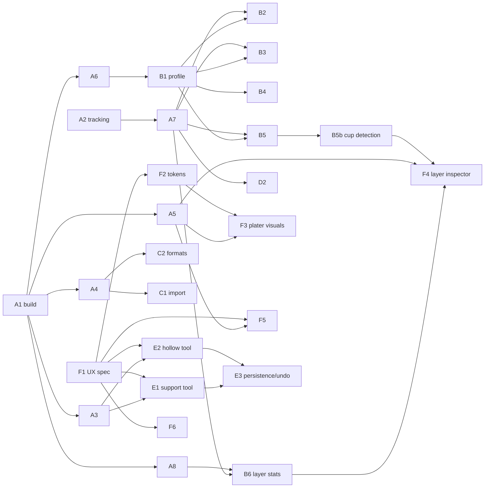

# PrusaSLA: SLA-focused fork plan

This plan is written for a group of agents working at the same time. Each task says which files it owns, what it depends on, and how to check that it's done. Two main tracks run side by side:

- **Engine track:** SLA slicing, support generation, hollowing and export (streams B, C, D).
- **Experience track:** SLA editing tools, UX and visuals (streams E, F). It builds against fixture data, so it doesn't have to wait for engine changes.

Stream A sets things up and stays on to merge work. Stream G handles quality checks.

---

## 1. Codebase facts this plan is based on

Snapshot of `master` at `6f510128d7` (3.0.0-alpha11). Check these before relying on them.

| Area | Location | Notes |
|---|---|---|
| SLA pipeline | `src/libslic3r/src/libslic3r/SLAPrint.{hpp,cpp}`, `SLAPrintSteps.{hpp,cpp}` | Object steps: `slaposAssembly → Hollowing → DrillHoles → ObjectSlice → SupportPoints → SupportTree → Pad`. Print steps: `slapsMergeSlicesAndEval → slapsRasterize` (`include/libslic3r/PrintSteps.hpp`). |
| SLA algorithms | `src/libslic3r/src/libslic3r/SLA/` | Support point generator and `SupportIslands/`, default and branching trees, pad, hollowing (OpenVDB), raster (AGG), Z correction, clustering, concave hull. |
| Archive output | `src/libslic3r/src/libslic3r/Format/{SL1,SL1_SVG,SLAArchiveWriter}.*`, `src/slic3r-shared/src/Slic3r/Biz/ResultExport/SLA/{SL1,Zipper}.cpp` | `sla_archive_format` is a free-text string (default `"SL1"`). There is no format registry. |
| SLA config | `src/slic3r-domain/src/Slic3r/Domain/ConfigDefsSLA.cpp` (~1300 lines), `ConfigBoxesSLA.cpp`, `FullConfigSLA.cpp` | Printer, print and material options, including tilt and dynamic delay options. |
| Model data | `src/slic3r-domain/include/Slic3r/Domain/ModelObject.hpp` | `sla_support_points`, `sla_drain_holes` are still in the model. |
| Slicing results → UI | `src/slic3r-shared/.../Biz/Slicing/SlicingInteractor.*`, `Biz/SLAResultCache.*`, `Biz/SLAObjectCache.*`, `Biz/GeneratedSupportPointsCache.*` | Listener-based caches, keyed by `SlicingId`. |
| SLA preview | `src/libvgcode/.../SlaViewer.{hpp,cpp}`, `src/slic3r-shared/.../App/Preview/SlaViewerWrapper.*`, `PreviewRenderModule.cpp` | Shows meshes plus a clipping plane and a layer slider. There's no 2D layer inspector. |
| Plater tools | `src/slic3r-shared/.../App/Plater/*Gizmo*`, `App/Scene/IGizmo.hpp` (`enum class ToolType`), `PlaterRenderModule.cpp` (tool dialog registration), `ToolGizmosUiInfo.cpp` | **No SLA tools exist in the new app:** no support points, hollowing or drain holes tool, and no SLA auto-orientation. |
| Legacy GUI (not built) | `src/slic3r/GUI/Gizmos/GLGizmoSlaSupports.cpp` (1544 lines), `GLGizmoHollow.cpp` (1006), `GLGizmoSlaBase.cpp`, `Jobs/SLAImportJob.cpp`, `Jobs/RotoptimizeJob.cpp` | Not referenced by any CMake file. Use only as a **porting reference**. |
| Theme / UI toolkit | `src/slic3r-shared/.../App/Theme.hpp`, `ThemeTypes.hpp`, `App/Yoga/`, `App/Imgui/` | ImGui with Yoga layout. Dark and light styles. |
| Presets | `resources/presets/` | Contains **only** `prusa-research-fff`. SLA vendor presets exist only as test data: `src/slic3r-shared/test/data/presets/prusa-research-sla/`. |
| Tests | `tests/sla_print/` (Catch2, `sla_print_tests`), `src/slic3r-shared/test/`, `tests/data/sla_islands/`, `src/slic3r-shared/test/data/sla_roundtrip{1,2}.3mf` | |
| Architecture rules | `src/slic3r-shared/README.md` | Dependencies must go `App → Biz → Domain`. `App` stays platform-agnostic. Platform-specific code goes in `slic3r-app-desktop` / `slic3r-platform-wx`. |
| Build | `doc/Build.md`, `CMakePresets.json`, `SLIC3R_ENABLE_PROFILING` (Tracy) | Deps take hours to build, so build them **once** and share them. |
| Code style | `doc/CodeStyle.md`, `.clang-format` | |

---

## 2. Product decisions (settle in Phase 0, defaults given)

Stream A records the answers in `doc/sla-fork/DECISIONS.md`. If nobody decides, **use the default** and keep going.

| ID | Decision | Default |
|---|---|---|
| D1 | What happens to FFF? | **Keep FFF code and hide it by default** behind an "SLA-first" app setting. Don't delete it; deletions make upstream merges painful. |
| D2 | Target printers | Prusa SL1/SL1S first. Then generic MSLA printers that use **openly documented** archive formats. Skip encrypted or proprietary formats. |
| D3 | Upstream sync | Add an `upstream` remote → `prusa3d/PrusaSlicer`. `master` tracks upstream plus merges. Fork work goes to the integration branch `sla/main`. Keep changes additive, in new files where possible. |
| D4 | Minimum platform for CI | Windows/MSVC is required. Linux is recommended as a second job. |
| D5 | Visual direction | **Decided:** the fork uses the palette in section 2.1. Stream F designs within it and doesn't propose a different one. |

### 2.1 Fork color palette (binding for all streams)

The owner chose this palette. All interface and scene colors come from it.

| Token name | Hex | Character |
|---|---|---|
| `Sage100` | `#CAD2C5` | pale sage (lightest) |
| `Sage300` | `#84A98C` | mid sage green |
| `Teal500` | `#52796F` | muted teal |
| `Slate700` | `#354F52` | deep teal-slate |
| `Slate900` | `#2F3E46` | charcoal slate (darkest) |

**Rules**
1. Hard-code these hex values in one place only: a palette table in `Theme.cpp`, owned by F2. Every other file uses `Platform::Color` tokens and never writes RGB literals. Look for existing RGB literals in `App/` and move them over during F2.
2. **Derived colors are allowed** as mixes of palette colors with each other, with white, or with black (hover, active, disabled, and alpha). Name each derived color in the palette table and give the formula next to it.
3. **Only off-palette colors allowed:** one warm amber for warnings and one red for errors. The palette is all cool greens, so warnings wouldn't stand out otherwise. Starting values:
   - Warning on dark: `#E3A857` (5.27:1 on `Slate900`)
   - Error on dark: `#E07A6B` (3.77:1, use with an icon and label)
   - Light theme: darker variants `#9A6A1F` and `#B5483E`
   
   F2 may tune these. Don't add other hues.
4. The **resin model tint** follows the material's `material_colour` when it's set. Otherwise it falls back to `Sage300`. It's the one place where a color comes from user data, not the palette.

**Measured contrast (WCAG 2.x), used for the mappings below**

| Foreground on background | Ratio | Allowed use |
|---|---|---|
| `Sage100` on `Slate900` | 7.13 | body text (AA and AAA) |
| `Sage100` on `Slate700` | 5.66 | body text (AA) |
| `#FFFFFF` on `Teal500` | 4.86 | button labels (AA) |
| `Sage100` on `Teal500` | 3.13 | large text and icons only |
| `Sage300` on `Slate900` | 4.23 | accents, icons, large text; **not** body text |
| `Slate900` on `Sage100` | 7.13 | light-theme body text |
| `Slate700` on `Sage100` | 5.66 | light-theme links and secondary text |
| `Slate700` vs `Slate900` | 1.26 | surface layering only; **never** the only cue for information |
| `Teal500` vs `Sage300` | 1.86 | don't use as the only way to tell two states apart |

**Default token mapping** (F2 finalizes; A8 uses these values from day one)

| `Platform::Color` | Dark theme | Light theme |
|---|---|---|
| `WindowBg` | `Slate900` | `Sage100` mixed 60% with white (`#DFE4DC`) |
| `WindowBgAlternate` | `Slate700` | `Sage100` |
| `Text` / disabled | `Sage100` / `Sage100` at 50% alpha | `Slate900` / `Slate900` at 50% alpha |
| `TextLink` | `Sage300` | `Slate700` |
| `AccentPrimary` (selection, active tool) | `Sage300` | `Teal500` |
| `AccentSecondary` | `Teal500` | `Sage300` |
| `Button` / hovered / active | `Teal500` / mixed 15% white / `Sage300` | `Teal500` / mixed 15% black / `Slate700` |
| `Control` | `Slate700` | `#EEF1EC` (`Sage100` mixed with white) |
| `SceneBgTop` → `SceneBgBottom` | `Slate700` → `Slate900` | `#EEF1EC` → `Sage100` |
| `Warning` / `Error` | amber / red from rule 3 | darker amber / red from rule 3 |
| `SlaModelResin` | `material_colour`, or `Sage300` | same |
| `SlaSupport` | `Sage100` | `Slate700` |
| `SlaPad` | `Teal500` | `Teal500` |
| `SlaSupportPointAuto` / `Manual` | `Sage300` / `Sage100` with a `Slate900` outline | `Teal500` / `Slate900` |
| `SlaDrainHole` | `Sage100` ring | `Slate900` ring |
| `SlaHollowInterior` | `Slate700` | `Sage300` |
| `SlaIslandWarning`, `SlaCupWarning` | Warning amber | Warning amber |
| `SlaLayerArea` (chart) | `Sage300` line, `Teal500` fill at 40% alpha | `Teal500` line, `Sage300` fill at 40% alpha |

Model, supports and pad must be told apart **by lightness**, not by hue alone. F3 checks this with a grayscale screenshot test (G3).

---

## 3. Rules for running agents at the same time

### 3.1 Branches and worktrees
- Each task gets its own git worktree and a branch named `sla/<TASK-ID>-<slug>`, based on `sla/main`.
- PRs target `sla/main`. Stream A merges them through a merge queue and rebases the queue daily.
- Keep PRs small: one task, or one sub-step of a large task.

### 3.2 Build sharing (important for throughput)
- Stream A builds `deps/` once (task A1). Every worktree configures with `-DCMAKE_PREFIX_PATH=<shared deps destdir>`.
- **Build only the targets you need:**
  - Engine agents (B, C-core): build `libslic3r` and `sla_print_tests`.
  - Biz/App agents: build the `slic3r-shared` test target.
  - Build the full desktop app only for visual verification.
- Limit how many agents run a full app build at once (start with `cores / 8`). Use a compiler cache (sccache/ccache) if A1 confirms it works with MSVC and PCH.

### 3.3 File ownership and hotspot files
Every task lists the paths it **owns**. An agent may create files anywhere under those paths. It must not edit paths another in-flight task owns.

These **hotspot files** are shared. Change them only in small PRs labelled `hotspot`, merged ahead of other work:

- `src/slic3r-shared/include/Slic3r/App/Scene/IGizmo.hpp` (`ToolType`)
- `src/slic3r-shared/src/Slic3r/App/Plater/PlaterRenderModule.cpp` / `.hpp`
- `src/slic3r-shared/src/Slic3r/App/Plater/ToolGizmosUiInfo.cpp`
- `src/slic3r-domain/src/Slic3r/Domain/ConfigDefsSLA.cpp`, `ConfigBoxesSLA.cpp`
- `src/libslic3r/include/libslic3r/PrintSteps.hpp`, `SLAPrint.hpp`
- `src/libslic3r/include/libslic3r/SLAResult.hpp`, `Biz/Slicing/SlicingInteractor.hpp`
- `src/slic3r-shared/.../App/Theme.cpp`, `ThemeTypes.hpp`
- Any `CMakeLists.txt`: only add lines, keep file lists sorted to reduce conflicts.

Phase 0 **reserves** enum values, config keys, theme tokens and registration stubs up front. Later tasks can then put their work in their own new files and rarely touch hotspots.

### 3.4 Task tracking
- Progress is tracked **only** in [ROADMAP.md](ROADMAP.md). Its todos are session-sized pieces of the tasks in this plan, and each one references the PLAN task ID it belongs to.
- Tick a todo in the same commit as the work. When several agents run at once, each one edits only its own todo lines. That keeps merge conflicts to an occasional trivial checkbox fix.
- Longer findings (profiling numbers, format investigations, parity checklists) go in `doc/sla-fork/<topic>/`. The todo links to them.

### 3.5 Definition of done (every task)
1. The owned targets build on Windows/MSVC with no new warnings in changed files.
2. The relevant test binaries pass (`sla_print_tests`, `slic3r-shared` tests), with new tests for new behavior.
3. `clang-format` is applied to changed lines, and `doc/CodeStyle.md` is followed.
4. There are no edits outside owned paths, except hotspot PRs that were requested.
5. Any change to a user-visible string is marked for translation (`L("...")` / `_u8L`).
6. The roadmap todo is ticked with a result note, and follow-ups are added as new todos.

---

## 4. Phase 0: Contracts and infrastructure (stream A, about 1–3 agents)

Phase 0 is short and gates Phase 1. A1 and A2 must finish first; A3–A8 can then run at the same time.

| ID | Task | Owns | Depends | Acceptance |
|---|---|---|---|---|
| **A1** | **Build bootstrap:** build deps once. Document shared-prefix configure for worktrees in `doc/sla-fork/BUILD.md`. Record baseline build times and test results. Evaluate a compiler cache. | `doc/sla-fork/BUILD.md`, CI config | — | A fresh worktree builds `sla_print_tests` against shared deps. The baseline test report is committed. |
| **A2** | **Branching and tracking:** add the `upstream` remote, create `sla/main`, and add `DECISIONS.md`. Keep [ROADMAP.md](ROADMAP.md) in sync with this plan. | `ROADMAP.md`, `DECISIONS.md` | — | Every task in this plan has at least one roadmap todo. |
| **A3** | **Reserve plater tool slots:** add `ToolType::SlaSupportPoints` and `ToolType::SlaHollow`. Add stub gizmos (`App/Plater/SlaSupportPointsGizmo.*`, `App/Plater/SlaHollowGizmo.*`) with empty dialogs, registered in `PlaterRenderModule`. Show them only when printer technology is SLA, and hide FFF-only tools when SLA is active. | the hotspot files listed | A1 | With an SLA printer, both toolbar buttons appear and open empty dialogs. FFF tools are hidden. |
| **A4** | **Archive format registry:** add an `ISlaArchiveFormat` interface and a factory keyed by `sla_archive_format` (reader and writer, file extensions, thumbnail spec). Move SL1 and SL1_SVG onto it with no change in behavior. | `libslic3r/Format/`, `Biz/ResultExport/SLA/` | A1 | Existing SL1 export is byte-identical on the fixture corpus. A new format only needs one new `.cpp` file and one registration line. |
| **A5** | **SLA fixture pack for UI work:** a helper in `slic3r-test-utils` that loads fixture 3MFs, slices them headlessly, and fills `SLAResultCache` / `SLAObjectCache` / `GeneratedSupportPointsCache`. Also add a debug command-line flag `--sla-fixture <3mf>` that loads the result straight into Preview. | `src/slic3r-test-utils/`, `doc/sla-fork/fixtures/` | A1 | Stream F can open Preview with real SLA data without running the plater workflow. |
| **A6** | **Benchmark corpus and metrics harness:** 10–20 representative models (miniatures, hollow figurines, flat parts, lattices, tall thin parts, and the models in `tests/data/sla_islands`). Add a CLI or test entry point that writes JSON: time per step, support point count, unsupported island count, support and pad volume, resin volume, layer count, and a hash of each rasterized layer. | `tests/sla_bench/`, `tests/data/sla_corpus/` | A1 | Two runs on the same commit give identical hashes. Timings are recorded in `doc/sla-fork/baseline.json`. |
| **A7** | **Reserve config keys:** add every new option planned in B/C/D to `ConfigDefsSLA.cpp` in one PR, with defaults that keep current behavior. Mark them hidden, or Expert mode, until the feature lands. | `ConfigDefsSLA.cpp`, `ConfigBoxesSLA.cpp` | A2 | New keys load and save through 3MF and presets. Behavior doesn't change. |
| **A8** | **Reserve theme tokens and result fields:** add SLA semantic colors to `ThemeTypes`: `SlaModelResin`, `SlaSupport`, `SlaPad`, `SlaSupportPointAuto`, `SlaSupportPointManual`, `SlaIslandWarning`, `SlaDrainHole`, `SlaHollowInterior`, `SlaCupWarning`, `SlaLayerArea`. Add a single palette table (section 2.1) to `Theme.cpp` and switch the existing tokens to the default mapping in 2.1. Add optional fields to `SLAResult` for per-layer area, peel-force estimate and detected issues. Leave them empty for now. | `ThemeTypes.hpp`, `Theme.cpp`, `SLAResult.hpp` | A1 | Compiles. The app runs in the fork palette in both themes, and every token uses the 2.1 default mapping. |

After Phase 0, stream A stays on as **integrator**: it runs the merge queue, handles hotspot PRs, keeps rebasing on upstream, and triages blocked tasks.

---

## 5. Phase 1: Parallel streams



### Stream B: SLA engine (`src/libslic3r/src/libslic3r/SLA/`, `SLAPrint*`), about 4–6 agents

Rule for this stream: **measure first.** Every optimization PR includes before/after numbers from A6. Every quality change includes a corpus diff.

| ID | Task | Owns | Depends | Acceptance |
|---|---|---|---|---|
| B1 | Profile the corpus with Tracy (`SLIC3R_ENABLE_PROFILING=ON`). Write a hotspot report ranked by wall time and memory for each step. **No code changes.** | `doc/sla-fork/profiling/` | A6 | The report names the top 10 hotspots with file:line, and B2–B5 are re-prioritized from it. |
| B2 | **Support point generation quality:** fix unsupported islands and overhang misses in `SupportPointGenerator.cpp` and `SupportIslands/`. Add regression tests for `tests/data/sla_islands/*.svg` and the corpus. Expose density and minimum-feature controls through the keys reserved in A7. | `SLA/SupportPointGenerator.*`, `SLA/SupportIslands/`, `tests/sla_print/sla_supptgen_tests.cpp` | B1, A7 | Unsupported island count on the corpus doesn't increase and drops on known failure cases. Points per object drop or stay the same. |
| B3 | **Branching tree improvements:** reduce total support volume and avoid collisions with the model. Keep trees easy to snap off near the model surface (contact-head tuning). | `SLA/BranchingTreeSLA.*`, `SLA/SupportTreeBuilder.*`, `SLA/SupportTreeMesher.*`, `tests/sla_print/sla_supptreeutils_tests.cpp` | B1 | Support volume drops by X% (target set from B1) with 0 new unsupported points on the corpus. |
| B4 | **Pad and zero elevation:** make the pad robust when printing directly on the plate. Improve pad generation speed. | `SLA/Pad.*`, `SLA/ConcaveHull.*` | B1 | No pad failures on the corpus. Pad step time is recorded, before and after. |
| B5 | **Hollowing performance and quality** (OpenVDB path). | `SLA/Hollowing.*` | B1 | Hollowing time or memory improves. Wall thickness stays within tolerance (add a test). |
| B5b | **Trapped resin and suction cup detection:** find enclosed cavities and cup-shaped regions for the current orientation. Report them in `SLAResult` issues (A8). Suggest drain hole positions. | new `SLA/CavityAnalysis.*`, tests | B5, A8 | Correctly flags synthetic cup and cavity fixtures. Suggested holes lie on the surface and don't intersect supports. |
| B6 | **Per-layer statistics:** exposed area, island count, and a peel-force estimate from area plus tilt settings. Fill the A8 `SLAResult` fields, computed during `slapsMergeSlicesAndEval`. | `SLAPrintSteps.cpp` (merge and eval section), new `SLA/LayerStats.*` | A8 | Values match analytic results on test shapes. No measurable slowdown (<2%). |
| B7 | **SLA auto-orientation:** port or rewrite the optimizer behind legacy `RotoptimizeJob`. Objectives: least supports, least peel area, cup avoidance (uses B5b when available). | new `slic3r-biz-algorithms` or `libslic3r/SLA/Orientation.*`, tests | B1 | Deterministic results. Corpus support volume under the chosen orientation is ≤ that of the input orientation. |
| B8 | **Z-correction and raster quality:** anti-aliasing and gamma review, and light-bleed compensation in `ZCorrection.*` and `AGGRaster.hpp`. | `SLA/ZCorrection.*`, `SLA/AGGRaster.hpp`, `SLA/RasterBase.*`, `sla_zcorrection_tests.cpp` | B1 | Raster hash changes are **intentional**, documented and tested. |
| B9 | **Invalidation and cancellation correctness:** audit the step invalidation map in `SLAPrint.cpp` (see commit `a9423798f4`). Add tests where each config key is changed and only the expected steps re-run. | `SLAPrint.cpp` (apply and invalidation), `tests/sla_print/sla_print_tests.cpp` | A7 | A table-driven test covers every SLA config key. |

### Stream C: Formats, import and connectivity, about 2–3 agents

| ID | Task | Owns | Depends | Acceptance |
|---|---|---|---|---|
| C1 | **SLA archive import in the new app** (`.sl1`, `.sl1s`, `.slx`): port legacy `SLAImportJob` onto the A4 registry. Rebuild a mesh from layer images using `RasterToPolygons`. Add a plater import action. | `Biz/Format/SlaImport*`, `libslic3r/Format/` readers | A4 | Round trip: export, then import, gives a mesh within tolerance on the corpus. |
| C2 | **Additional open archive formats**, prioritized by D2. Each format is a separate sub-task (`C2.<fmt>`) with its own file. | `libslic3r/Format/<Fmt>.*` | A4 | Byte-level spec conformance tests. Files open in a reference viewer (e.g. UVtools), checked manually and recorded under `doc/sla-fork/formats/`. |
| C3 | Printer metadata for each format: display mirror and orientation, resolution, thumbnail sizes. Validate against `display_*` options. | format files, tests | C2 | A mirrored or rotated display test pattern comes out correct in every format. |
| C4 | Upload SLA archives through existing print hosts (PrusaLink/Connect) and removable drives. Check format and extension handling. | `Biz/PrintHost/` (SLA paths only) | A4 | Upload works against a mock host in tests. |

### Stream D: Config, presets and materials, about 2 agents

| ID | Task | Owns | Depends | Acceptance |
|---|---|---|---|---|
| D1 | **Bundle SLA presets:** promote the Prusa SLA vendor bundle into `resources/presets/`. Update `RepositoryManifest.json`, the config wizard and first run. | `resources/presets/prusa-research-sla/`, manifest | A2 | A fresh profile can pick SL1S with materials. Preset loading tests pass. |
| D2 | Connect the A7 keys to settings pages: category, Simple/Advanced/Expert mode placement, tooltips, and material overrides. | `ConfigBoxesSLA.cpp` (hotspot, batched) | A7, B tasks as they land | Every new key has a tooltip and correct mode. The settings search finds it. |
| D3 | **Exposure calibration helper:** built-in calibration models plus a project generator that sets up a multi-bed exposure bracket (one exposure per bed). | `resources/calibration/sla/`, `Biz/Calibration/Sla*` | D1 | Generates a valid multi-bed project that exports. |
| D5 | **Resin profile import from Chitubox, Lychee and sliced archives:** read foreign profiles into a neutral struct, map them onto `sla_material` presets with a per-key status report, and save them as user presets. Available from the GUI and the CLI. Full design and todos: ROADMAP.md milestone M3. | `Biz/Preset/Import/`, `App/ResinImportDialog*` | A7 (generic motion keys), A4 (sliced-archive fallback) | Chitubox `.cfg` round-trips through the mapper with every key accounted for. `.cfgx`/`.lyr` are either supported or documented as not feasible. |
| D4 | **Resin economics:** resin used per bed and per project, cost, and bottles, from `material_density`/`bottle_*`. Provide it as a Biz-layer interactor for F5. | `Biz/SlaPrintEconomics.*` | A5 | Unit tests against hand-computed values. |

### Stream E: SLA plater tools (functional ports), about 2–3 agents

Stream E implements **behavior**, using the A8 theme tokens for all colors. Stream F owns how things look. E exposes only the hooks F needs.

| ID | Task | Owns | Depends | Acceptance |
|---|---|---|---|---|
| E1 | **SLA support points tool:** port `GLGizmoSlaSupports` onto `IToolGizmo`, following the patterns in `PaintOnSupportsGizmo` and `CutGizmo`. Features: auto-generate (through `GeneratedSupportPointsCache`), add, remove and move points, head diameter, island markers, clipping plane, and "apply / discard". | `App/Plater/SlaSupportPoints*`, `Biz/Scene/SlaSupportPoints*` | A3, F1 (spec only; can start before it) | Parity checklist against the legacy gizmo, recorded in `doc/sla-fork/parity/`. Manual points survive a re-slice. |
| E2 | **Hollow and drain holes tool:** port `GLGizmoHollow`. Hollowing parameter preview, place, move and resize drain holes, and a one-click "accept suggestions" for B5b. | `App/Plater/SlaHollow*`, `Biz/Scene/SlaDrainHoles*` | A3 (B5b is optional) | Parity checklist. Drain holes carry through to the sliced mesh. |
| E3 | **Persistence and undo:** undo/redo for E1/E2 edits (`App/Undo/`), and 3MF round trip checked against `sla_roundtrip{1,2}.3mf`. | `App/Undo/Sla*`, 3MF tests | E1, E2 | Round-trip tests pass. Undo/redo across tool sessions works. |
| E4 | **Per-object SLA overrides in the object list:** supports on/off, tree type, hollowing on/off, per object. | `App/ObjectList*` (SLA branch), override dialogs | A7 | Overrides persist and correctly invalidate only that object's steps. |
| E5 | **SLA auto-orient action:** a toolbar or context-menu command that runs B7 as a job with progress and cancel. | `App/Plater/SlaOrient*` | B7 (use a stub orientation until it lands) | Works on a multi-object selection. Undo is supported. |

### Stream F: UX and visuals, about 3–4 agents, runs alongside B–E

Stream F designs and builds the look and flow. **It isn't blocked by the engine:** it uses A5 fixtures and mock data for B6/B5b outputs until the real data lands.

| ID | Task | Owns | Depends | Acceptance |
|---|---|---|---|---|
| F1 | **UX spec:** SLA user journeys (import → orient → support → hollow → slice → inspect → export/send), an audit of current screens with an SLA printer selected, wireframes, interaction specs for E1/E2/F4. Wireframes and mockups use **only** the section 2.1 palette. | `doc/sla-fork/ux/` | — (starts immediately) | Reviewed spec. Each later F/E task links the section it implements. |
| F2 | **Apply the palette:** finalize the 2.1 mapping in `Theme.cpp` for dark and light themes. Name every derived color. Tune the amber and red. Move RGB literals found in `App/` and `libvgcode` onto tokens. Resin tint follows `material_colour` with a `Sage300` fallback. Review icon recoloring for the light theme (`Yoga::Icon::set_replace_strings`). | `Theme.cpp`, `ThemeTypes.hpp`, stray color literals | A8, F1 | Screenshots in both themes attached. The contrast table in 2.1 is re-verified. A grep finds no RGB literals left in `App/` outside `Theme.cpp`. |
| F3 | **Plater SLA visuals:** translucent resin-tinted model rendering, distinct support/pad/model materials, an elevation indicator, a build-volume and vat-outline style, and styling for E1/E2 overlays (point glyphs, island markers, hole previews). | `App/Scene/Sla*Render*`, `resources/shaders/` (new SLA shaders only), E1/E2 visual hooks | F2, A5 | Visual golden screenshots (G3) for 3 fixture scenes, dark and light. Model, supports and pad can still be told apart in a grayscale render. |
| F4 | **Preview layer inspector:** a 2D view of the current layer (polygons or raster at display resolution, with a pixel grid at high zoom). A per-layer area and peel-force chart docked beside the layer slider. Island and cup markers you can click to jump to the layer. | `App/Preview/SlaLayerInspector*`, `App/Preview/SlaLayerChart*`, `libvgcode/SlaViewer.*` (additions) | A5 (mock B6 data first), B6, B5b | Scrubbing a 2000-layer fixture stays smooth (target 60 fps). The chart matches B6 data. |
| F5 | **SLA sidebar summary:** resin ml and cost, bottles, print time, layer count, model/support/pad volume split, and an issues list (islands, cups) that links to the preview. | `App/SidebarSla*` | A5, D4 (mock first) | Values match D4 unit tests on fixtures. Layout works at the minimum window size. |
| F6 | **SLA-first shell:** SLA default on first run (D1), welcome dialog path, hiding FFF-only UI through the D1 setting, SLA-specific hints and notifications, keyboard shortcuts for E1/E2. | `App/WelcomeDialog*` (SLA path), `App/AppSettings*` flag, `HintNotification` content | A3, F1, D1 | A new user reaches an exported SL1S file without seeing FFF-only UI. |
| F7 | **Iconography:** toolbar icons for support points, hollow, orient and inspector, plus issue glyphs and empty-state illustrations, in dark and light variants. Illustrations use only the 2.1 palette. Monochrome icons stay white so the light-theme recoloring still applies. | `resources/icons/sla_*.svg` | F1 | Icons render crisply at 1x and 2x and follow the existing icon grid. |
| F8 | **Export and send flow polish:** pre-export checklist (unsupported islands, cups, height limit), archive format picker driven by the A4 registry, and a progress/result dialog. | `App/ResultExport/Sla*` | A4, F1 | Blocking issues show before export, and the user can override them. |

### Stream G: Quality, about 1–2 agents, continuous

| ID | Task | Owns | Depends | Acceptance |
|---|---|---|---|---|
| G1 | CI job: build, `sla_print_tests`, `slic3r-shared` tests, and the A6 corpus metrics diff posted on each PR to `sla/main`. | CI config, `tests/sla_bench/` scripts | A1, A6 | A PR that changes a raster hash or grows support volume >2% gets flagged. |
| G2 | Robustness corpus: non-manifold, self-intersecting, huge, tiny, and zero-thickness meshes. Slicing must not crash or hang (with a timeout). | `tests/data/sla_robustness/`, tests | A6 | No crashes. Every failure is added as a roadmap todo. |
| G3 | Visual regression: offscreen renders of fixture scenes (reuse the thumbnail rendering path in `tests/thumbnails/` and `ThumbnailRenderer`) with image-diff tolerances. Include a grayscale variant for the lightness check in 2.1. | `tests/sla_visual/` | A5 | Stable on CI; there's a documented way to update goldens. |
| G4 | Nightly upstream merge rehearsal: merge `upstream/master` into a throwaway branch, build and test, and report conflicts by owning stream. | CI | A2 | Conflict report is produced nightly. |

---

## 6. Phase 2: Integration and polish (after most Phase 1 work lands)

1. **End-to-end journey pass (F + E):** walk the F1 journeys on the integrated build. Add gaps as new roadmap todos.
2. **Parameter tuning (B + D):** retune default print and material presets with the B2/B3 changes, and review the corpus metrics diff.
3. **Performance budget (B + F):** full pipeline time on the corpus is ≤ baseline. Preview interaction stays at 60 fps on fixtures.
4. **Docs:** user-facing SLA guide in `doc/sla-fork/user-guide/`, and an updated `README.md` for the fork.
5. **Release candidate:** version bump, packaging, and a known-issues list.

---

## 7. Suggested swarm allocation

| Wave | Concurrent agents | Tasks |
|---|---|---|
| 0a | 2 | A1, A2, and F1 (F1 needs no build) |
| 0b | 4–5 | A3, A4, A5, A6, A7, A8 (A8 is small), F1 continued |
| 1 | 12–16 | B1→B2–B9, C1–C4, D1–D4, E1–E5, F2–F8, G1–G3, plus 1 integrator (A) |
| 2 | 6–8 | Phase 2 items, plus follow-up todos in the roadmap |

Throughput is limited by builds and hotspot merges, not by the number of agents. If the merge queue backs up, pause new claims in streams that touch hotspots (E, D2, F2) before cutting engine work.

## 8. Agent brief template

Starting an agent:

`AGENTS.md` at the repo root holds the standing instructions, and OpenCode loads it automatically. To start an agent on one todo:

```
/do-todo <ROADMAP ID>        # or /next-todo [milestone]
```

For other agent tools, use this brief:

```
Work on todo <ID> from doc/sla-fork/ROADMAP.md in the PrusaSLA fork. Follow AGENTS.md. Read PLAN.md sections 1, 2.1, 3.3 and 3.5.
Work in a worktree on branch sla/<ID>-<slug> from sla/main, build only the targets you need,
tick the todo in the same commit, and open a PR to sla/main.
```
